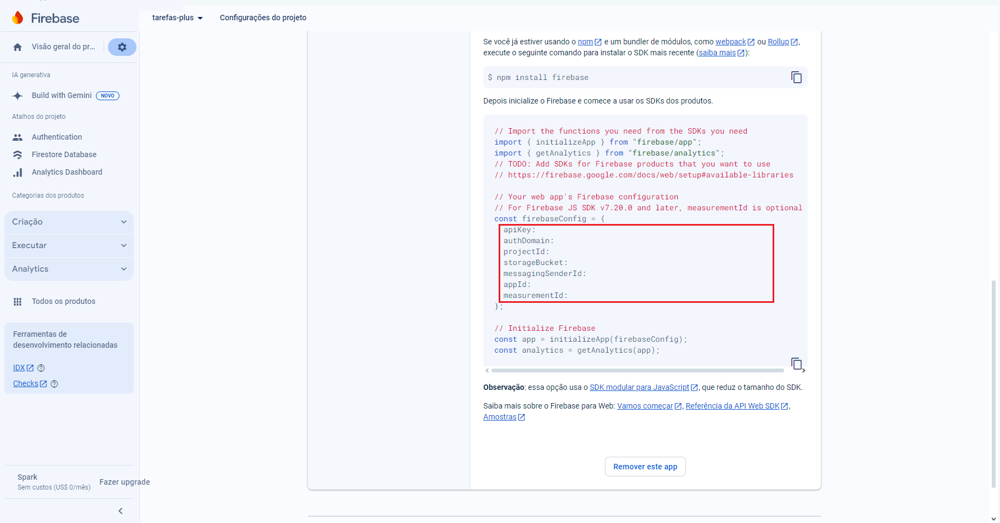

# Tarefas-plus

<!-- 1405x425 -->


## Sumário

- [\[Tarefas plus\]](#Tarefas-plus)
  - [Sumário](#sumário)
  - [Introdução](#introdução)
  - [Tecnologias Usadas](#tecnologias-usadas)
  - [Ambiente de desenvolvimento](#ambiente-de-desenvolvimento)
  - [Informações Técnicas](#informações-técnicas)
  - [Snapshots](#snapshots)
  - [Como Executar o Projeto](#como-executar-o-projeto)
  - [Contato](#contato)

## Introdução

Este é um projeto de um sistema de tarefas, com o diferencial de compartilhas suas tarefas com outras pessoas e que elas possam fazer comentários. O foco principal deste projeto é o uso da tecnologia Next.js e entender com funciona Client-Side Rendering (CSR), Server-Side Renderign (SSR) e Static Site Generation (SSG).

## Tecnologias Usadas

&nbsp;
&nbsp;
&nbsp;

## Ambiente de desenvolvimento

- Virtual Studio Code - Version 1.92.1
- GitHub Desktop - Version 3.4.3
- Node.js - Version 20.17.2

## Informações técnicas

- Utilizado Next.js;
- Utilizado TypeScript;
- Utilizado regras e padrões do Prettier;
- Para criação das tarefas foi usado o [Firebase](https://firebase.google.com/?hl=pt);
- Utilizado a biblioteca [NextAuth](https://next-auth.js.org) para sessão do usuário.

## Snapshots

### Tela Home

**Obs**: Nesta tela foi utilzado o conceito de Static Site Generation (SSG) para informar a quantidade geral de posts e comentários a cada 60 segundos.


### Tela Login


### Tela Terefas


### Tela Comentários

**Obs**: Nesta tela foi utilzado o conceito de Server-Side Renderign (SSR) para carregar as informações do post ao entrar página.


## Como Executar o Projeto

Para executar o projeto em uma ambiente de desenvolvimento siga as instruções:

1. Clone o repositório:

```bash
git clone https://github.com/LucasDoGit/tarefas-plus
cd tarefas-plus
```

2. Instale as dependências:

```bash
npm install
```

3. Crie ou utilize um projeto no firebase com o **Firebase Database**, então copie o acesso ao seu firebase:



4. Crie e configure Chaves de API para autenticação com o Google, seguindo a biblioteca do [NextAuth](https://next-auth.js.org/getting-started/introduction)


5. Cole as chaves de acesso no arquivo **.env** localizado na raiz do projeto:


6. As configuração das variaveis **NEXTAUTH_URL** e **NEXT_PUBLIC_URL** dependem do ambiente que vai ser executado. Caso seja local a url deve ser utilizada "http://localhost:3000" e caso seja em um deploy a url deve ser a do seu dominio, exemplo "https://tarefas-plus-sandy.vercel.app":


6. use o comando abaixo para iniciar o projeto e aguarde.

```bash
npm run dev
```

7. Feito! O projeto deve ser iniciado e pode ser acessado usando um navegador.

## Contato

Para obter mais informações, entre em contato comigo em:

- Email: lucas.saiz19@gmail.com
- GitHub: https://github.com/LucasDoGit
